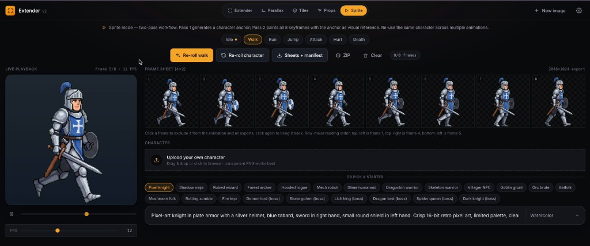
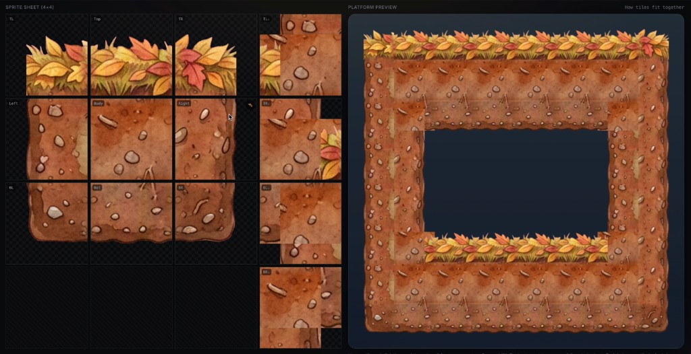
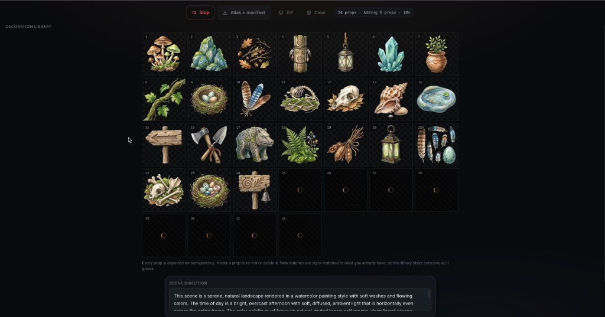

# INDIEGEN

**AI Game Asset Studio on Solana.** Generate production-ready 2D sprites,
animations, tilesets, parallax backgrounds and low-poly 3D models in minutes —
export-ready for Unity, Godot and Unreal. Powered by the **$INDIEGEN** token:
pay per generation, no subscriptions.

🌐 **[indiegen.net](https://indiegen.net)** · 𝕏 **[@IndieGenSol](https://x.com/IndieGenSol)**

---

## What it makes

| Studio | Output |
| --- | --- |
| **Sprite** | Animated characters — idle, walk, run, attack, hurt, death — coherent across every frame via two-pass pose mapping. 6 body plans. |
| **Tiles** | 13-tile autotile sets in one pass, corner-reconciled, with an AI art-director QA review. |
| **Parallax** | Multi-layer sidescroller backdrops with per-layer depth & scroll speed, auto-extended to any width and seam-healed. |
| **Props** | Growing libraries of distinct decoration sprites, deduped each batch, packed into a transparent atlas. |
| **3D** *(beta)* | Low-poly models with PBR textures and a rig, exported as GLB / FBX / OBJ. |

Exports: PNG spritesheets, per-frame PNGs, JSON manifests, GLB/FBX/OBJ — drop
straight into your engine.

## Examples

Real assets generated in the studio:

| Animated sprites | Autotile tilesets |
| --- | --- |
|  |  |

| Parallax backgrounds | Prop libraries |
| --- | --- |
|  |  |

## Pricing — pay per generation

Each generation has a fixed USD price, paid directly from your wallet in
**$INDIEGEN** at the live market rate (no prepaid balance, no subscription). The
payment is only spent on a successful result — a failed generation is free to
retry.

## Tech

- **[Next.js 14](https://nextjs.org/)** (App Router) · React 18 · TypeScript · Tailwind
- **HTML Canvas** for client-side image work · **JSZip** for project bundles
- **[OpenRouter](https://openrouter.ai)** for image + reasoning models; **[Meshy](https://meshy.ai)** for 3D
- **Solana** — wallet auth (Sign-In with Solana), Token-2022, live price oracle (DexScreener)

## Project structure

```
app/
├── api/            Generation + auth + pricing endpoints
├── components/     Studio UI (per-workspace) + landing
├── lib/            Domain logic, token config, server (auth, payments, ledger)
├── studio/         The studio app (/studio) + 3D studio (/studio/3d)
└── page.tsx        Landing page
remotion/           Promo video (Remotion)
```

## Development

```bash
npm install
# add OPENROUTER_API_KEY (and optionally MESHY_API_KEY) to .env.local
npm run dev
```

Generation is **free until the token is configured**; set
`NEXT_PUBLIC_TOKEN_MINT` + `NEXT_PUBLIC_TOKEN_TREASURY` (via `npm run set-token`)
to switch on paid per-generation mode.

## License

MIT
